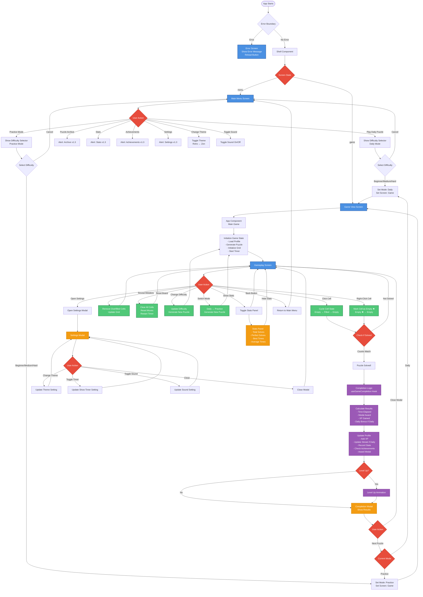

# Hidden Grid - Game Flow Chart

This document provides a comprehensive flowchart of the entire Hidden Grid game, including all screens, user interactions, and game states.

## Quick Reference: Screen Flow

```
App Start
  ↓
Error Boundary (catches errors)
  ↓
Shell Component
  ├─→ Main Menu Screen
  │   ├─→ Difficulty Selector (Daily/Practice)
  │   ├─→ Settings (placeholder)
  │   ├─→ Stats (placeholder)
  │   └─→ Achievements (placeholder)
  │
  └─→ Game View Screen
      ├─→ Gameplay Screen
      │   ├─→ Settings Modal
      │   ├─→ Stats Panel
      │   └─→ Completion Modal
      │
      └─→ Back to Main Menu
```

## Complete Game Flow



## Detailed State Flow

### 1. Application Initialization
- Error Boundary wraps entire app
- Shell component manages screen state (menu/game)
- Profile loaded from localStorage

### 2. Main Menu Screen
**Components:**
- MainMenu component
- Profile display (Title, Level, XP Bar)
- Theme toggle (Retro/Zen)
- Sound toggle

**Actions:**
- Play Daily Puzzle → Shows difficulty selector
- Practice Mode → Shows difficulty selector
- Puzzle Archive → Placeholder alert
- Stats → Placeholder alert
- Achievements → Placeholder alert
- Settings → Placeholder alert

### 3. Difficulty Selection
**Modal Overlay:**
- Beginner (6x6, unlimited reveals)
- Medium (8x8, 1 reveal)
- Hard (10x10, 0 reveals)
- Cancel button

### 4. Game Screen
**Initialization:**
- Generate puzzle from seed
- Initialize empty grid
- Start timer
- Reset move counter

**Gameplay Loop:**
- User interacts with grid cells
- System checks row/column counts
- Timer continues running
- Move counter increments

**Available Actions:**
- Click cell: Toggle filled/empty
- Right-click cell: Mark as empty (✖)
- Reveal Mistakes: Remove overfilled cells
- Reset Board: Clear all and restart
- Change Difficulty: New puzzle with new difficulty
- Switch Mode: Daily ↔ Practice
- Show/Hide Stats: Toggle stats panel
- Open Settings: Open settings modal
- Back: Return to main menu

### 5. Puzzle Completion
**Detection:**
- Checks if all row counts match
- Checks if all column counts match
- Allows multiple valid solutions

**Completion Process:**
1. Calculate time elapsed
2. Determine medal (Gold/Silver/Bronze/None)
3. Calculate XP gain
4. Check for daily bonus (if daily mode)
5. Update streak (if daily mode)
6. Record statistics
7. Check achievements
8. Award XP and medals
9. Check for level up
10. Show completion modal

### 6. Completion Modal
**Displays:**
- Time taken
- Medal earned
- XP gained
- Daily bonus (if applicable)
- Level up notification (if applicable)
- New achievements unlocked (if any)

**Actions:**
- Next Puzzle → Starts new puzzle (same mode)
- Close → Returns to game (puzzle remains solved)

### 7. Settings Modal
**Options:**
- Theme: Dark/Light
- Show Timer: Toggle
- Sound: Toggle

**Behavior:**
- Changes saved to profile
- Applied immediately

### 8. Stats Panel
**Displays:**
- Total solves (all difficulties)
- Perfect solves
- Best time per difficulty
- Average time per difficulty

## Key State Management

### useGameState Hook
- Manages puzzle generation
- Grid state (CellState[][])
- Move counter
- Timer
- Row/column counts
- Solve detection

### useGameCompletion Hook
- Monitors solve state
- Handles completion logic
- Updates profile
- Manages completion modal state

### useProfile Hook
- React state for profile
- Automatic localStorage sync
- XP, medals, stats, achievements
- Settings persistence

## Data Flow

```
User Action → Component → Hook → State Update → Re-render → UI Update
```

## Error Handling

- Error Boundary catches React errors
- Shows user-friendly error screen
- Provides reload option
- Logs errors to console

